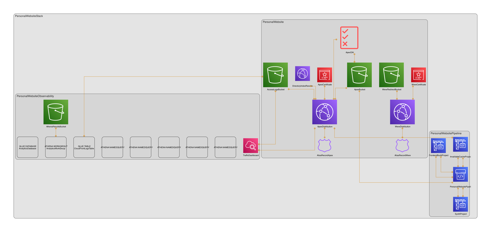

# Personal Website

A modern, responsive personal portfolio website built with Next.js and deployed on AWS using CDK infrastructure as code.

## 🚀 Features

- Modern, responsive design with smooth animations
- Statically exported Next.js site — no server at runtime
- Dark mode, seeded from local time of day on a first visit
- RSS feed, sitemap, and per-page structured data
- AWS CloudFront distribution for global content delivery
- Continuous deployment pipeline using AWS CodePipeline
- Infrastructure as Code using AWS CDK

## 🛠️ Tech Stack

- **Frontend:**

  - Next.js 15 (App Router, `output: 'export'`)
  - React 19
  - TypeScript
  - Tailwind CSS 3
  - Framer Motion

- **Infrastructure:**
  - AWS CDK
  - AWS CloudFront
  - AWS S3
  - AWS CodePipeline
  - AWS CodeBuild
  - CloudWatch RUM + Athena over CloudFront logs ([docs](./docs/analytics.md))

## 🏗️ Project Structure

```
├── frontend/              # Next.js frontend application (see its README)
├── lib/                   # AWS CDK infrastructure code
├── bin/                   # CDK app entry point
├── docs/                  # Analytics / observability notes
├── design.md              # The site's design language — read before adding UI
└── test/                  # Infrastructure tests
```

## System Architecture



## 🚦 Getting Started

### Prerequisites

- Node.js (version specified in .nvmrc)
- AWS CLI configured
- AWS CDK CLI

### Local Development

1. Install dependencies:

   ```bash
   npm install
   cd frontend && npm install
   ```

2. Run the frontend locally:

   ```bash
   cd frontend
   npm run dev
   ```

   Before pushing, verify the static export the pipeline actually builds — the
   dev server does not exercise it:

   ```bash
   cd frontend && npm run build
   ```

3. Deploy infrastructure (only required once):

   ```bash
   cdk deploy
   ```

4. Deploy and Update:

   ```bash
   git add .

   git commit -m "<YOUR_COMMIT_MESSAGE>"

   git push

   ```

> **Note — pipeline changes are not self-mutating.** The pipeline's CFN deploy
> step only updates `PersonalWebsiteStack` (site + observability). Changes to
> `lib/pipeline.ts` itself must be deployed manually:
>
> ```bash
> npm run build && npx cdk deploy PersonalWebsiteStackPersonalWebsitePipeline*
> ```

## 📝 License

This project is licensed under the terms specified in the LICENSE file.
