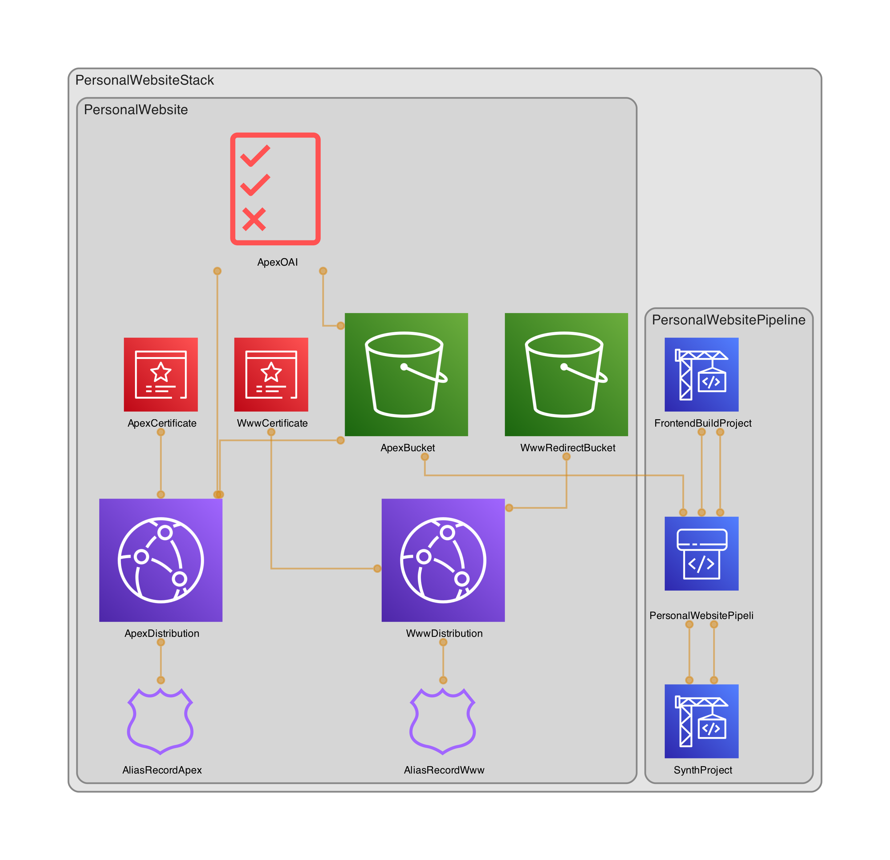

# Personal Website

A modern, responsive personal portfolio website built with Next.js and deployed on AWS using CDK infrastructure as code.

## 🚀 Features

- Modern, responsive design with smooth animations
- Server-side rendered React application using Next.js
- Dark mode support
- AWS CloudFront distribution for global content delivery
- Continuous deployment pipeline using AWS CodePipeline
- Infrastructure as Code using AWS CDK

## 🛠️ Tech Stack

- **Frontend:**

  - Next.js 13+ (App Router)
  - React
  - TypeScript
  - Tailwind CSS
  - CSS Modules

- **Infrastructure:**
  - AWS CDK
  - AWS CloudFront
  - AWS S3
  - AWS CodePipeline
  - AWS CodeBuild

## 🏗️ Project Structure

```
├── frontend/              # Next.js frontend application
├── lib/                   # AWS CDK infrastructure code
├── bin/                   # CDK app entry point
└── test/                  # Infrastructure tests
```


## System Architecture



## 🚦 Getting Started

### Prerequisites

- Node.js (version specified in .nvmrc)
- AWS CLI configured
- AWS CDK CLI


### Local Development

1. Install dependencies:

   ```bash
   npm install
   cd frontend && npm install
   ```

2. Run the frontend locally:

   ```bash
   cd frontend
   npm run dev
   ```

3. Deploy infrastructure (only required once):
   ```bash
   cdk deploy
   ```

4. Deploy and Update:

   ```bash
   git add .

   git commit -m "<YOUR_COMMIT_MESSAGE>"

   git push

   ```

## 📝 License

This project is licensed under the terms specified in the LICENSE file.
